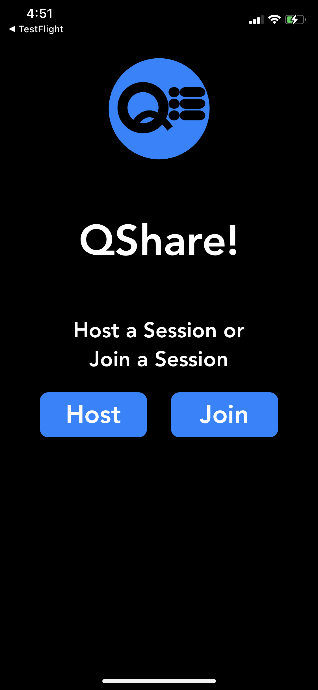
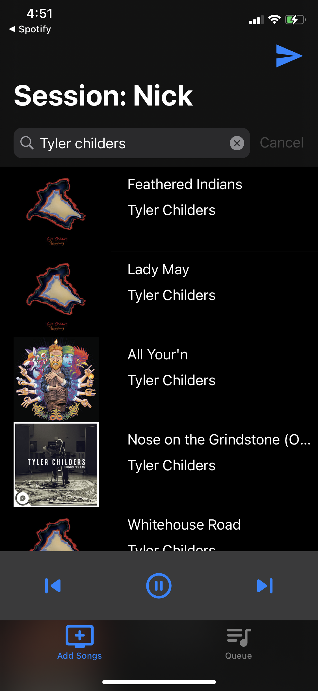
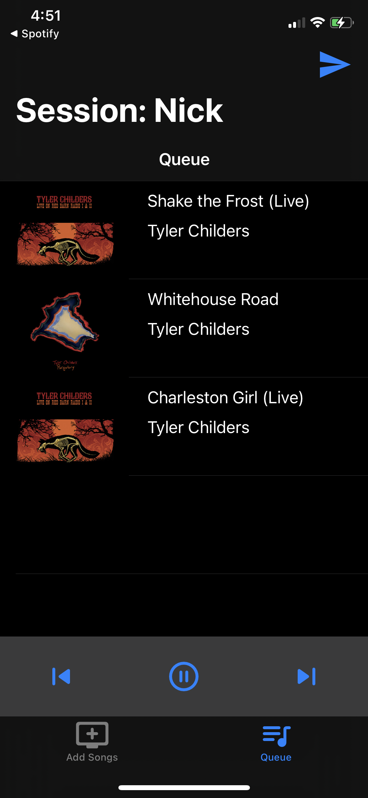
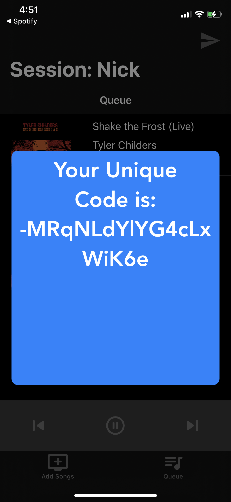

# QShare (Used to be called CrowdPlay) 

# An iOS application to allow people to collaborate on a Spotify Queue

# Usage
## The host has full control of playback while participants are limited on purpose to only adding to the queue
## Users can decide to either host their own session or join a session using a unique identifier given to each session

# TestFlight
## [Here](https://testflight.apple.com/join/9ht8DJDx) is a link to download the app on TestFlight
## Although as of Jan 25th this is an outdated version, I will be updating this link when new builds are approved for beta testing
## Also this app is focused around playing music off a single phone (ideally connected to a speaker) with the idea that the people 
## in the session are together in person to hear
## the music off the one phone. 
## This app will not do much for anyone using it by themselves.

# Main Screen

# Add song screen

# Queue screen

# Share unique code

